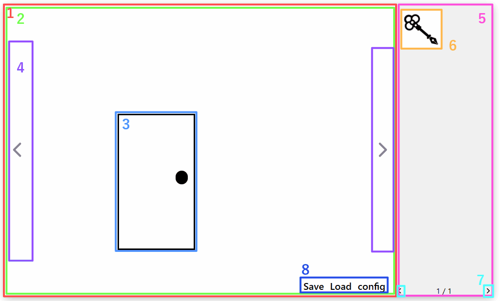
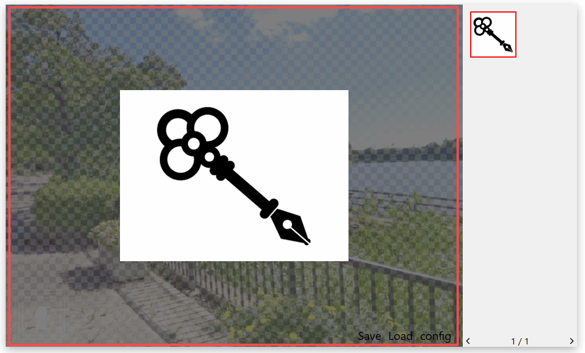
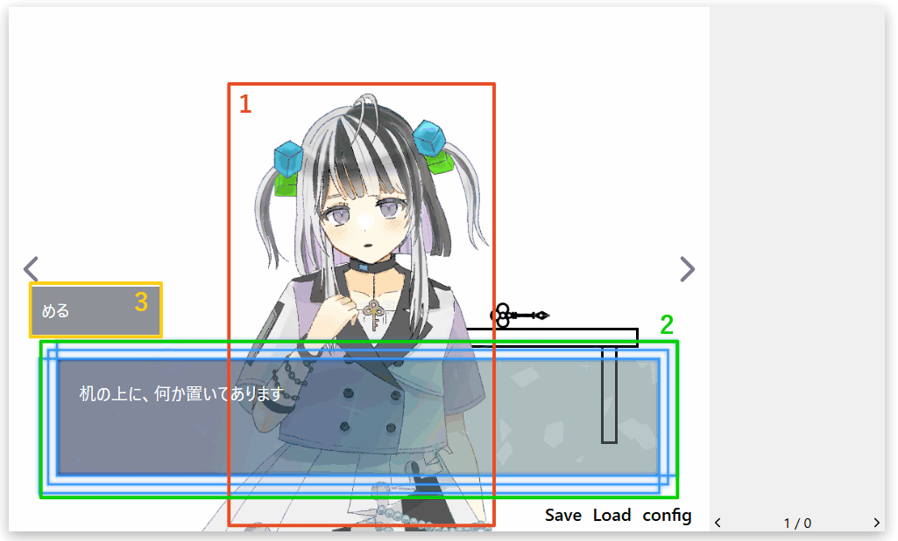
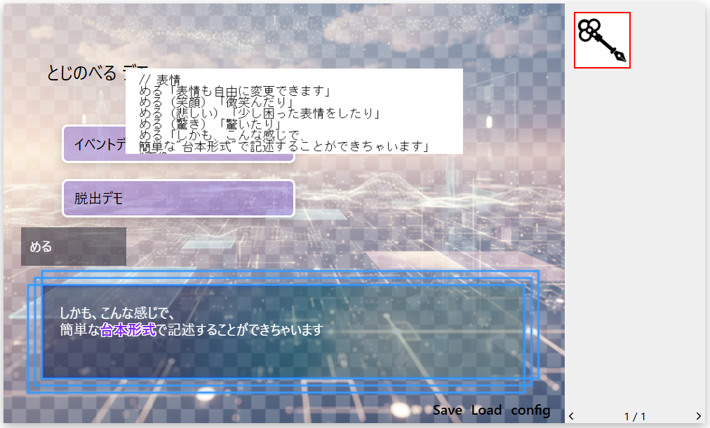
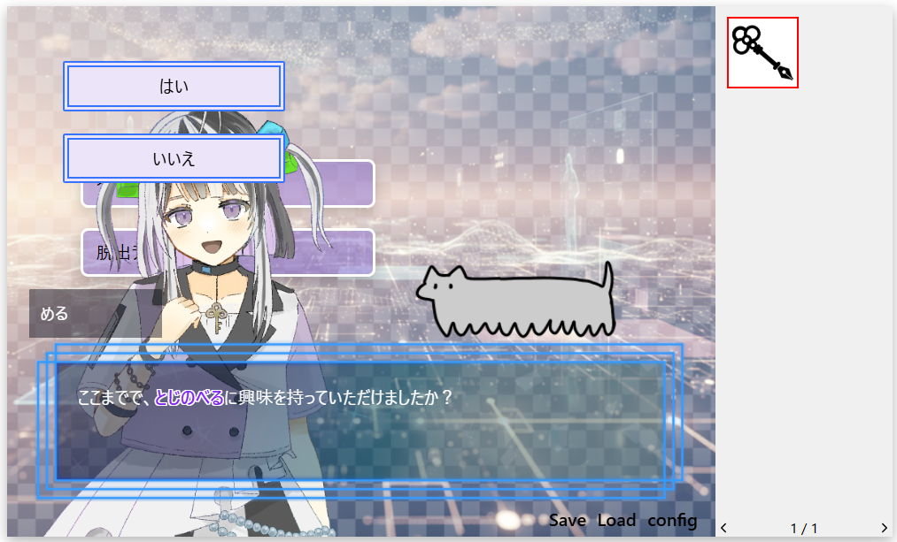
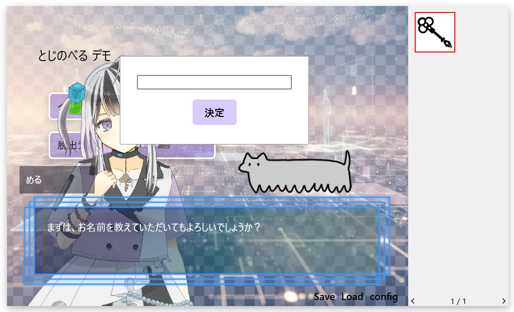
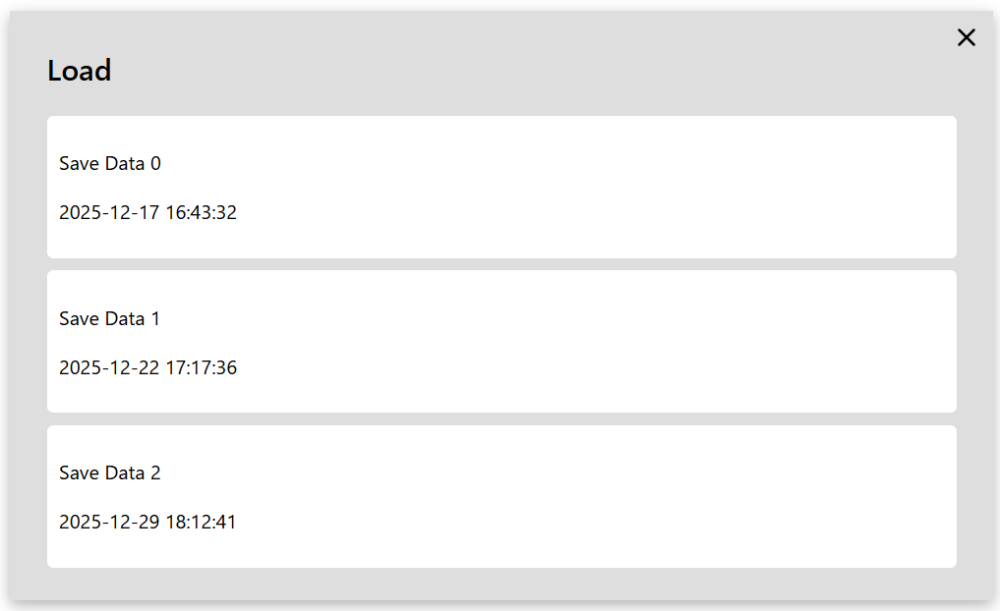
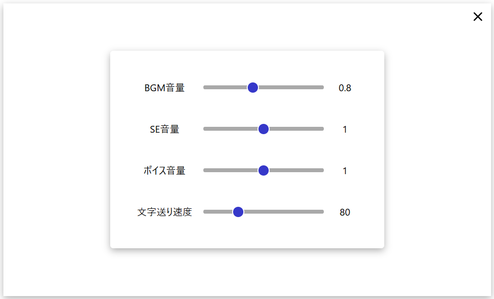

# 🎮ゲーム画面構成
ゲーム実行時の画面に表示される要素について解説します。

## 🖼通常画面

1. **シーン**  
   1つの画面（場所）を指します。

2. **シーン背景**  
   シーンに設定されている背景画像です。

3. **ホットスポット**  
   クリックできるエリアです。  
   ※透明で見えない場合があります。

4. **方向移動ボタン**  
   現在のシーンから上下左右の別シーンへ移動するボタンです。

5. **アイテムボックス**  
   所持中のアイテム一覧を表示します。

6. **アイテム**  
   所持しているアイテム1つ1つ。  
   - クリック：選択状態になる  
   - ダブルクリック：アイテムドロワーが開く（詳細表示）

7. **アイテムボックス ページ移動ボタン**  
   アイテム数が多い場合、次のページへ移動できます。

8. **メニュー**  
   セーブ・ロード・設定など、ゲーム全体の操作を行うボタンです。

---

## 🎒アイテムドロワー

- アイテムの詳細情報を表示します。  
- ドロワー内にもホットスポットを配置できます。  
- 背景部分（暗転領域）をクリックすると閉じます。

---

## 🎬イベント画面
ホットスポットのクリックやシーン訪問などをトリガにして実行される画面です。  
イベントは順番に実行され、クリックで次のステップへ進みます。  

※イベント実行中はホットスポットをクリックできません。

### 通常表示

1. **立ち絵**  
   キャラクターの立ち絵画像。

2. **テキストボックス**  
   セリフやナレーションなど、文章を表示する領域。

3. **名前表示**  
   発言者の名前を表示します。

### オーバレイ表示
1. **イベント画像**  

   イベント中にのみ表示される画像。  
   ホットスポットとは異なりクリック不可です。

2. **選択肢**  

   イベント中に表示される選択肢。  
   ストーリーを分岐させることができます。

3. **入力フォーム**
  
   ユーザが文字を入力できる領域。  
   名前や暗証番号などを入力させる用途に使用します。

---

## 💾セーブ画面
  

- スロットを選択して現在の進行状況をセーブできます。  
- ×ボタンで画面を閉じます。

---

## 📂ロード画面
 
- スロットを選択して保存したデータをロードできます。  
- ×ボタンで画面を閉じます。

---

## ⚙️コンフィグ画面

ユーザが各種設定を変更できる画面です。
×ボタンで閉じます。

1. BGM音量調整
2. SE音量調整
3. ボイス音量調整
4. 文字送り速度調整
5. オート文字送り切替

各項目の表示/非表示は全体設定の「コンフィグ」から変更できます。
