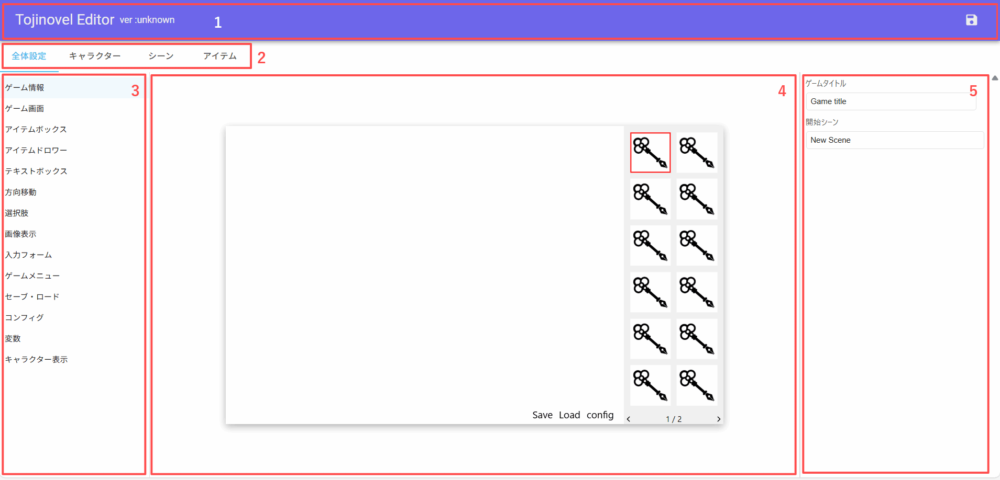
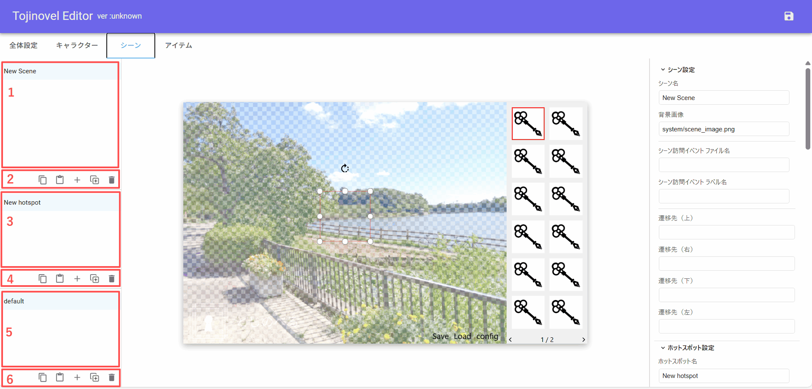
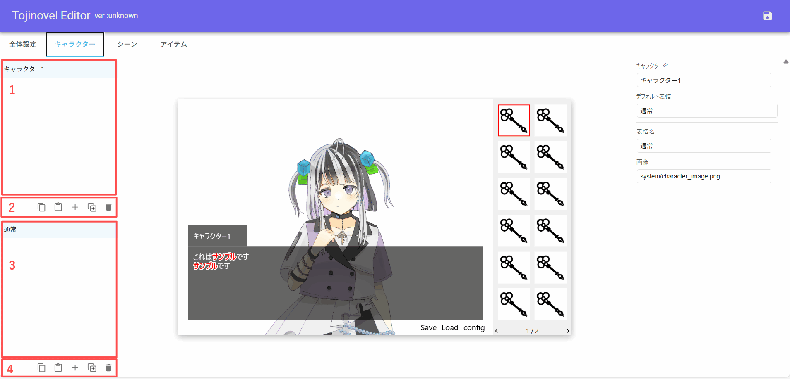
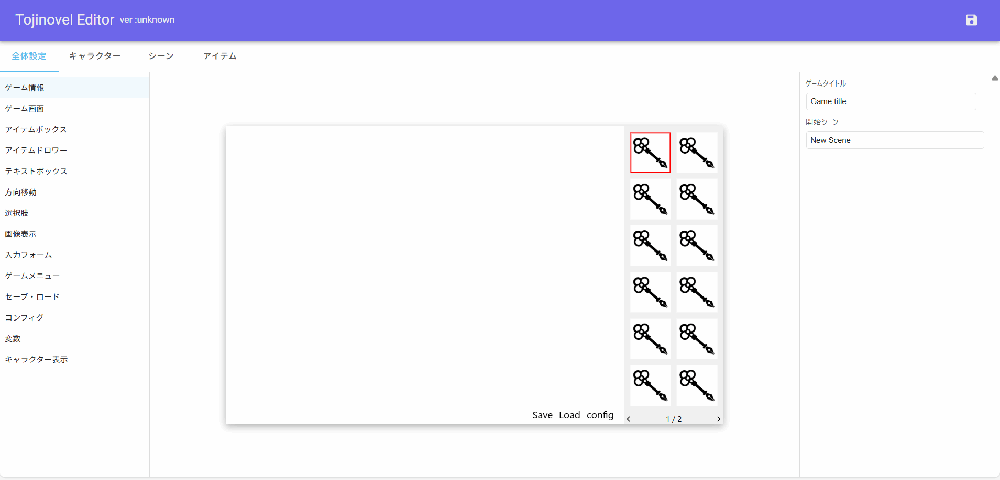

# 🛠️UIガイド
エディタの画面構成について解説します。

##  🖥️画面全体図

1. **ヘッダ**
2. **タブ**
3. **左パネル**（編集対象の選択）
4. **中央パネル**（プレビュー）
5. **右パネル**（パラメータ編集） 

## 👒ヘッダ
ヘッダには以下のボタンがあります。

| ボタン | 説明 |
|---|---|
| 元に戻す（Undo） | 直前の編集操作を取り消します |
| やり直し（Redo） | 取り消した操作をやり直します |
| 保存 | データを /game/data/gamedata.json に保存します |

## 🔧編集モード
タブで編集対象を切り替えます。
1. **全体設定**
1. **キャラクター**
1. **シーン**
1. **アイテム**

## 🧩シーン / アイテム編集
### 左パネル

1. **シーン / アイテム選択エリア**
2. **シーン / アイテム操作ボタン**
    コピー / ペースト / 追加 / 複製 / 削除
3. **ホットスポット選択エリア**
4. **ホットスポット操作ボタン**
    コピー / ペースト / 追加 / 複製 / 削除
5. **ステート選択エリア**
6. **ステート操作ボタン**
    コピー / ペースト / 追加 / 複製 / 削除

## 📝シナリオエディタ
シーン/アイテムタブでは、中央パネルの下部にシナリオエディタが表示されます。
イベントファイル（.txt）を直接編集することができます。

### 基本的な使い方

1. **ファイルを開く**
   - ファイルパス入力欄にパスを入力し、フォルダアイコンをクリック
   - または、右パネルの各イベント設定（シーン訪問イベント、クリックイベント、アイテム使用イベント）の横にある編集アイコン（✏️）をクリック

2. **ラベル指定**
   - ラベル名を入力してファイルを開くと、該当ラベル（`【ラベル名】`）の位置に自動スクロールします
   - ファイル全体が表示されるので、他のラベルも編集可能です

3. **新規ファイル作成**
   - 存在しないファイルパスを指定して開くと「ファイルが存在しません」と表示されます
   - 「新規ファイルを作成」ボタンで空のファイルを作成できます

4. **保存**
   - Ctrl+S または保存ボタンで、gamedata.json と一緒にイベントファイルも保存されます
   - 未保存の変更がある場合、ファイル名の横に「未保存」と表示されます

5. **閉じる**
   - ×ボタンでファイルを閉じます
   - 未保存の編集内容はバッファに保持されるため、再度開けば編集を続けられます

### 注意事項

> **⚠️ 編集の競合について**
>
> とじのべるのシナリオエディタでイベントファイルを編集中に、別のテキストエディタでイベントファイルを編集した場合、正しく動作しない場合があります。
>
> **推奨される作業フロー：**
> - イベントファイルの内容を編集するときは、シナリオエディタで編集
> - テキストエディタでシナリオを編集する場合は、とじのべるを開かない

## 🧑‍🎨キャラクター編集
### 左パネル

1. **キャラクター選択エリア**
2. **キャラクター操作ボタン**  
    コピー / ペースト / 追加 / 複製 / 削除
3. **表情選択エリア**
4. **表情操作ボタン**  
    コピー / ペースト / 追加 / 複製 / 削除

## 🌐全体設定

1. **ゲーム情報**
ゲームタイトル、開始シーン、共通シーンを設定します。

   **共通シーン**: すべてのシーンに共通して表示されるホットスポット（UI部品）を設定できます。
   既存のシーンから1つ選択すると、そのシーンのホットスポットが全シーンで表示されます。
   - 自作ゲームメニュー、常に表示される制限時間などに利用
   - 通常シーンの上に重ねて表示される（z-index: 1000-1100）
   - イベントから通常シーンと同じようにステート変更可能
   - デフォルトは空（無効）

2. **ゲーム画面**  
画面サイズ、アイテムボックスの配置、背景色などを設定します。

3. **アイテムボックス**  
アイテムボックスのデザイン、アイテム表示数などを設定します。  
中央パネルのアイテムボックスは、クリックでページ送りをテストすることができます。

4. **アイテムドロワー**     
アイテムドロワーのサイズなどを設定します。

5. **テキストボックス**  
イベント中に表示するテキストボックスのデザイン、標準文字送り速度などを設定します。  
中央パネルをクリックすることで、文字送りを再生することができます。

6. **方向移動**  
上下左右方向移動ボタンのデザインを設定します。

7. **選択肢**  
イベント中に表示する選択肢のデザインを設定します。

8. **画像表示**  
イベント中に表示する画像の位置・大きさを設定します。

9. **入力フォーム**   
イベント中に表示する入力フォームのデザインを設定します。

10. **ゲームメニュー**  
セーブ・ロードなど、メニューボタンの表示位置・デザインを設定します。

11. **セーブ・ロード**  
セーブスロット数、セーブ・ロード画面のデザインなどを設定します。

12. **コンフィグ**  
音量・文字送り速度などをユーザが設定する画面のデザインを設定します。

13. **変数**  
ゲーム内で登場する変数を登録します。  
中央パネルで操作します。

14. **キャラクター表示**  
立ち絵の最大表示数を設定します。

## 📐ガイドラインスナップ
ホットスポットの移動・リサイズ時に、他のホットスポットの辺や中心線、シーンの中央線に自動的にスナップします。
スナップ時にはマゼンタ色のガイドラインが表示されます。

- **Alt + ドラッグ**：スナップを一時的に無効化して自由に移動・リサイズできます

## ⌨ショートカットキー
- Ctrl + S：保存
- Ctrl + Z：元に戻す
- Ctrl + Y / Ctrl + Shift + Z：やり直し
- Ctrl + C：コピー（シーン/アイテム/ホットスポット/ステート）
- Ctrl + V：ペースト
- Delete：削除（シーン/アイテム/ホットスポット/ステート）
- Alt + ドラッグ：スナップを一時的に無効化
